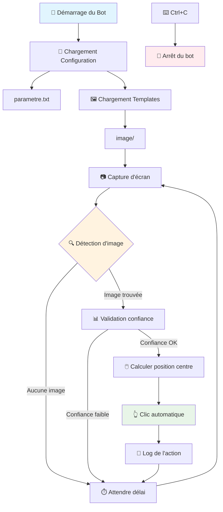
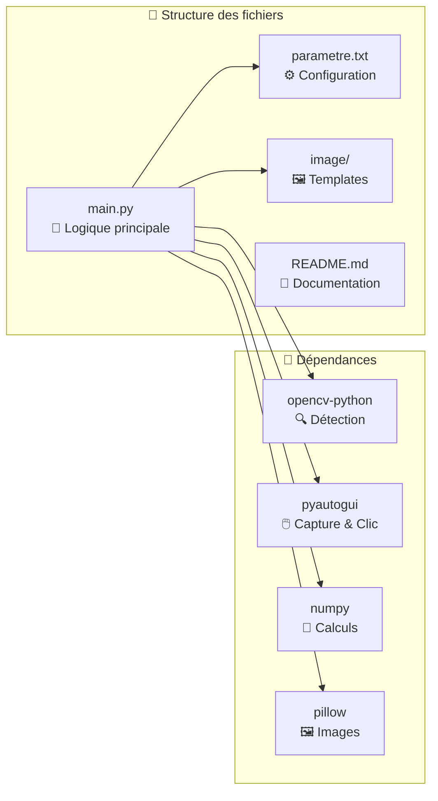
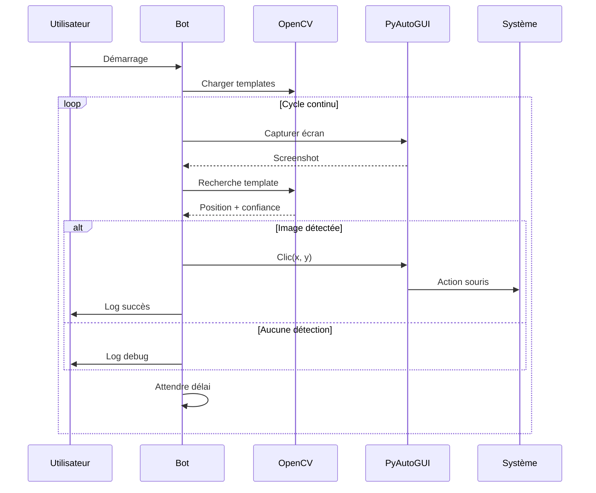

# Bot de Détection et Clic d'Images

Ce bot détecte automatiquement des images à l'écran et clique dessus quand elles sont trouvées.

## 🏗️ Architecture du système





## 🔄 Flux de fonctionnement

Le bot suit un cycle continu d'exécution :

1. **Initialisation** : Chargement de la configuration et des images templates
2. **Capture** : Prise d'une capture d'écran complète
3. **Analyse** : Recherche de correspondances avec les templates
4. **Détection** : Vérification du seuil de confiance
5. **Action** : Clic automatique sur l'image détectée
6. **Attente** : Pause selon le délai configuré
7. **Répétition** : Retour à l'étape 2

## 🚀 Installation

1. Les dépendances ont été installées automatiquement :
   - opencv-python (pour la détection d'images)
   - pyautogui (pour capturer l'écran et cliquer)
   - numpy (pour le traitement des images)
   - pillow (support d'images)

## 🧩 Composants techniques

### 🎯 Algorithme de détection



### 🔧 Classes et méthodes principales

- **`BotClickImage`** : Classe principale du bot
  - `charger_parametres()` : Lecture de la configuration
  - `charger_images_templates()` : Chargement des images de référence
  - `capturer_ecran()` : Capture d'écran via PyAutoGUI
  - `detecter_image()` : Détection par correspondance de template (OpenCV)
  - `cliquer_sur_position()` : Simulation de clic souris
  - `executer_cycle_detection()` : Cycle principal d'exécution

## ⚙️ Configuration

Modifiez le fichier `parametre.txt` pour ajuster les paramètres :

- **SEUIL_CONFIANCE** (0.0 à 1.0) : Précision de la détection (0.8 = 80%)
- **DELAI_SCAN** : Temps en secondes entre chaque scan
- **MODE_DEBUG** : Affiche plus d'informations (True/False)

## 📸 Ajout d'images

1. Placez vos images de référence dans le dossier `image/`
2. Formats supportés : PNG, JPG, JPEG, BMP, TIFF
3. Plus l'image est précise, meilleure sera la détection

## 🎮 Utilisation

1. **Ajoutez vos images** dans le dossier `image/`
2. **Configurez les paramètres** dans `parametre.txt`
3. **Lancez le bot** :

   ```bash
   python main.py
   ```

4. **Arrêtez le bot** avec `Ctrl+C`

## 📊 Informations affichées

Le bot affiche dans la console :

- ✅ Images détectées avec le pourcentage de confiance
- 📍 Coordonnées exactes du clic
- ⏰ Horodatage de chaque action
- 🔍 Informations de debug (si activé)

## ⚠️ Notes importantes

- Le bot clique sur la **première image** détectée à chaque cycle
- Plus le seuil de confiance est élevé, plus la détection est stricte
- Testez d'abord avec des images simples et distinctes
- Le bot continue à tourner jusqu'à ce que vous l'arrêtiez

## 🛠️ Dépannage

- **"Aucune image trouvée"** : Vérifiez que le dossier `image/` contient des fichiers
- **"Image non détectée"** : Réduisez le seuil de confiance ou utilisez une image plus précise
- **Clic imprécis** : L'image de référence doit être exactement celle affichée à l'écran

## Améliorations futures

- [ ] Ajouter un mode aléatoire pour le délai entre deux vérifications (par exemple, un délai compris entre 1 et 3 secondes) afin d’éviter la détection par des anti-bots
- [ ] Ajouter une interface graphique pour configurer les paramètres
- [ ] Simuler un mouvement de la souris avant le clic pour imiter un comportement humain, au lieu de déplacer instantanément la souris sur l’image à cliquer
- [ ] Mettre en place un système de logs qui enregistre les actions dans un fichier `.log`
  